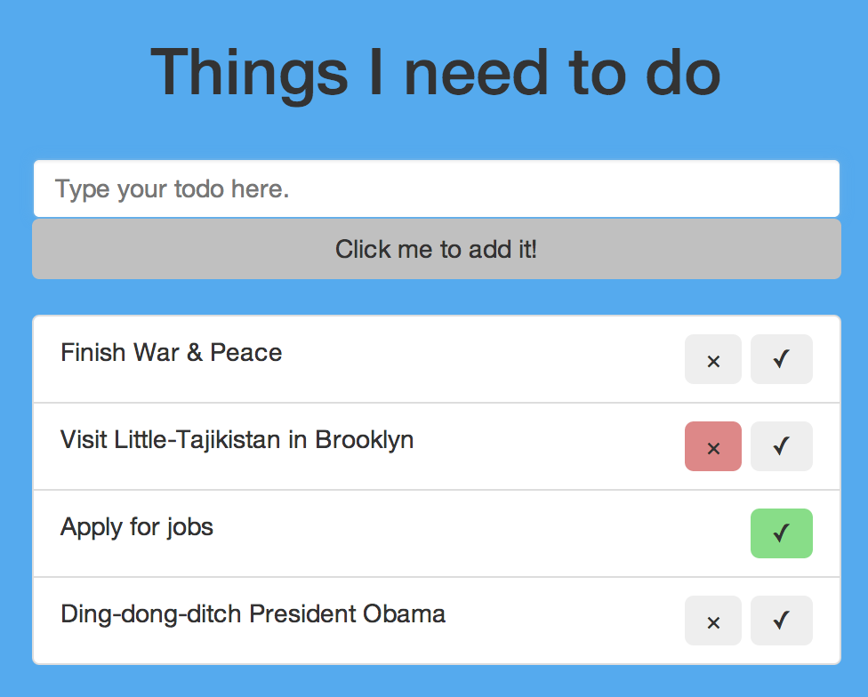
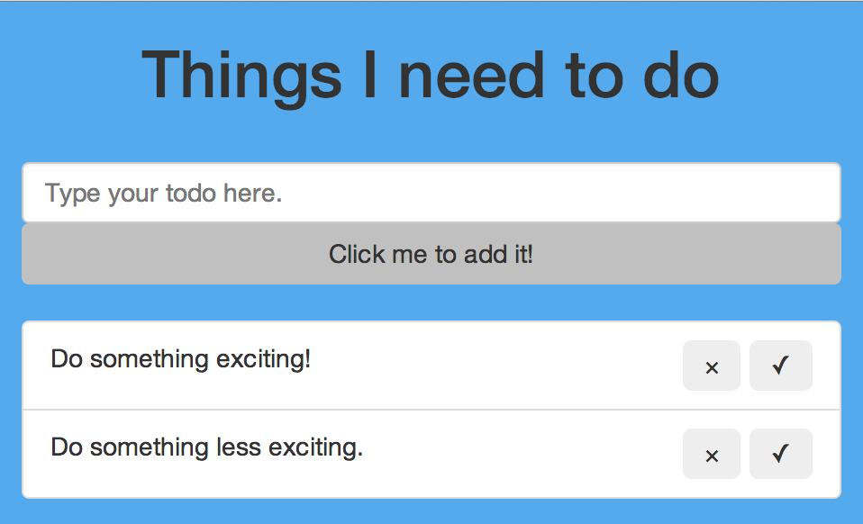

# Simple Todo

### App Description

We want to create a one page application that allows users to create a todo list, and enjoy the satisfaction of completing items from it.  Currently the application won't persist between sessions, but once we learn more Rails we will implement as a weekend project.

### Designer Mockup

### Deconstructing the mockup

Looking at the design, there's really three main things going on here:

* There's the application name ("Things I need to do")
* There's a form & submit button for the todo entry
* The list of previously submitted todos with inline buttons for rejecting the todo or completing it.

Our first steps will be creating a decent template to manipulate once we add JavaScript and jQuery later.

# Before we begin

So far, we've been building our applications in the context of a Rails application.  Here, we're going to keep it contained within one simple HTML document.

* Create a folder for your project
* Create a new document called `todo.html`.
* To the folder add in `bootstrap.css`, `bootstrap.js`, `jquery.js`, and `jqueryui.js`.  You can get them from the standard places, if you don't have them handy.

# The HTML

### Setting it up

Make sure to include the stylesheet for Bootstrap, plus the JavaScript files.  Spend a bit of time musing about which order to include the `js` files, since it does actually matter.  Additionally add style tags to the `head` and script tags to the `body` so that we can have custom styling and scripts as we build our application.

### Adding the Bootstrap

By now Bootstrap should not be foreign, and this design is reasonably simple.  In creating the application I used the following things:

* A container for the entire app
* A centered header for the title
* A half-width column for the rest of the app
* A form containing one text input and a submit button.  The button was made full width to avoid interrupting the visual flow
* An unordered `list group` for the todo items, which are made up of:
  * A `span` for the text
  * A `div` for the button group
  * Two `div`s which act as buttons (we're not going to use actual buttons, here.  We just want `div`s we can click)
  * All of these elements are floated to achieve the appropriate effect, so a `clearfix` is necessary on the list items so they have non-trivial height

### Adding some style

Once you have the basic components, you'll need to style them a little.  The divs for the buttons need to look like something is happening when you hover over them.

My colors:
* List item buttons: `#eee` as default, `#8d8` and `#d88` for confirm and cancel
* Body background: `#5ae` and that's about it.

Since we're using divs to act like buttons, make sure when you hover over them the cursor changes accordingly.  Remember, a good user interface should give you hints that something specific will happen so that you don't have to think while using it.

Once you achieve a static page that looks like this, call the instructor over for a quick code review.

# Next step

Go to [Part I](https://github.com/short-matthew-f/todo/blob/master/part_i_-_populate_the_todos.md)
